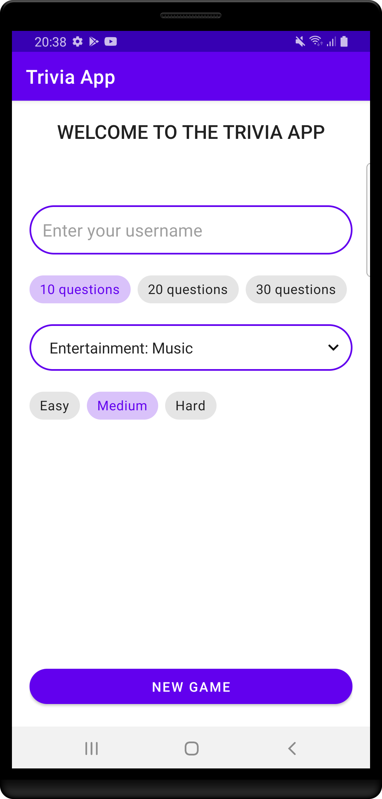
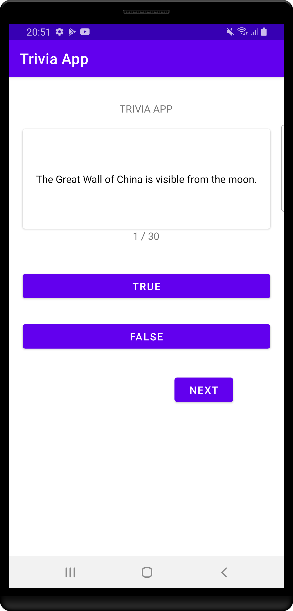

# Android Trivia App

The first part of this project was done in a [Android Bootcamp from Udemy](https://www.udemy.com/share/101WBM3@v8dLoK7gdd_BM8MPj1_SZwwpD3vbRcP_MMpsEN5K0Ig_fucV1Y6IUyW5FCANamHB/)

## What has been done ?
* UI to enter the parameters the user want to do his quiz
  * ChipGroups for the selection of the numbers of question and the level of difficulty
  * A Spinner to select the category 
* Connection with [OpenTrivia API](https://opentdb.com) using the Android Volley library
* The highest score is stored in the shared preferences

## What are the next steps ?
* Add the Room library ti store all the result of the last games
* Display a ranking with the best scores
* Improve the UI
  * Change the style of the application
  * Improve the UX on the quiz screen
  
* Add the possibility to do multiple choice questions

## Current UI

 
